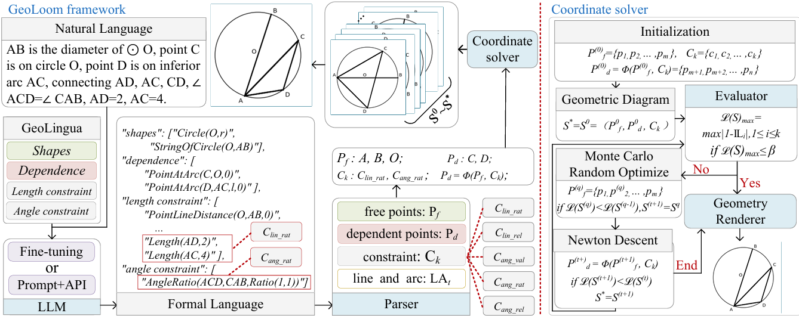

<div align="center">

## *GeoLoom: High-quality Geometric Diagram Generation from Textual Input*

<p align="center">
  
  
</p>

<p align="center">
  <a href="https://arxiv.org/abs/2512.08180">📄 Paper</a> •
  <a href="#-citation">📚 Citation</a>
</p>

</div>

## 🎉 Announcement

**🏆 This paper has been accepted at ICML 2026!** 🎉

We're excited to share our dataset with the community!


## 👥 Authors

<div align="center">

**Xiaojing Wei** • **Ting Zhang** •  **Wei He** • **Jingdong Wang** • **Hua Huang**<sup>✉</sup>

</div>


## 📖 Overview

**GeoNF** is a high-quality paired dataset for geometric text-to-diagram generation. It aligns natural language geometry problem descriptions with formal representations based on the **GeoLingua** formal language. The dataset is a core component of the **GeoLoom** framework, aimed at advancing research in automatic geometric diagram generation.


**GeoLoom** is a novel text-to-diagram generation framework for geometric domains. It addresses the challenge of producing spatially accurate diagrams from natural language descriptions by combining two core modules:

- **Autoformalization**: Translates natural language geometry problems into **GeoLingua**, a formal language specifically designed for diagram generation.
- **Coordinate Solver**: Maps formal constraints (e.g., lengths, angles, parallel/perpendicular relations) to precise coordinates using an efficient Monte Carlo optimization method.

- By leveraging formal representations, GeoLoom achieves superior structural fidelity compared to state-of-the-art baselines, offering a principled, interpretable, and scalable approach to automatic geometric diagram generation. 

<div align="center">
  
  <br>
  <em>🔺 Framework Overview of GeoLoom &nbsp;</em>
</div>

 
## GeoNF Dataset Structure


- `GeoNF/`
  - `train.json` – Training set (4,300 pairs)
  - `test.json` – Test set (430 pairs)
  - `test/` – Ground truth diagrams for test set
    - `1.png`, `2.png`, ...
  - `train/` – Ground truth diagrams for train set
    - `1.png`, `2.png`, ...
  - `README.md` – Dataset documentation


## 📚 Citation

If you find our work helpful, please consider citing:

```bibtex
@inproceedings{wei2026GeoLoom,
    title     = {GeoLoom: High-quality Geometric Diagram Generation from Textual Input},
    author    = {Wei, Xiaojing and Zhang, Ting and He, Wei and Wang, Jingdong and Huang, Hua},
    booktitle = {Proceedings of the International Conference on Machine Learning (ICML)},
    year      = {2026}
}
```
</div>
